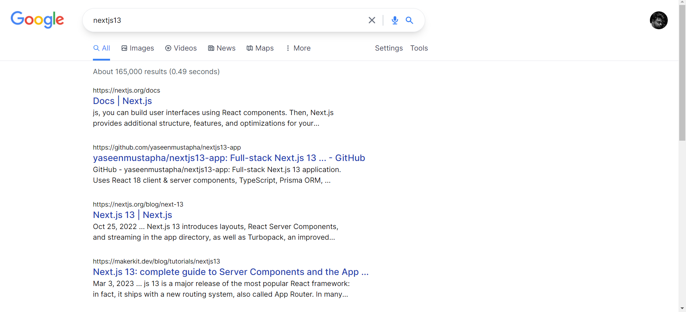
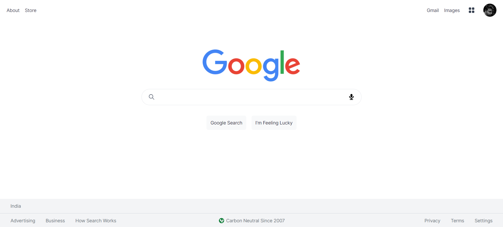
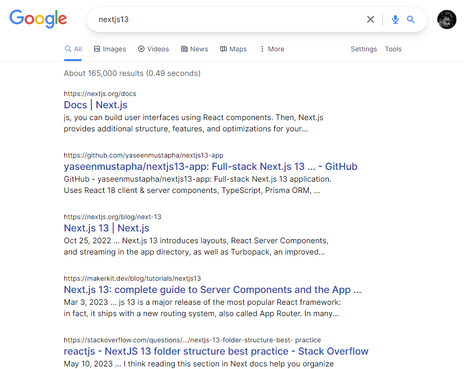
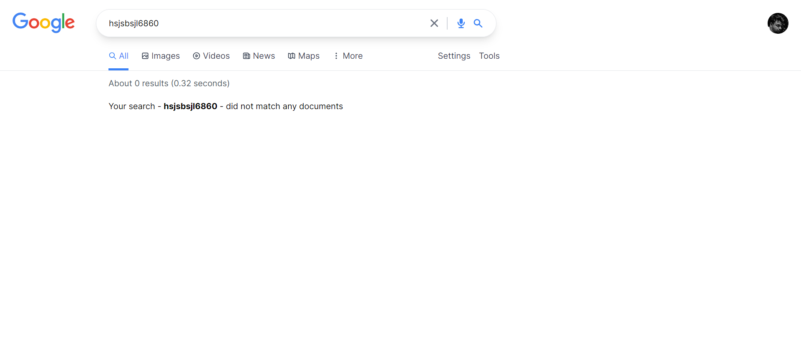
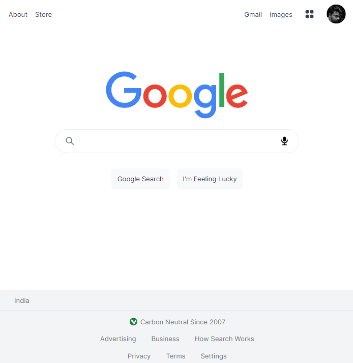
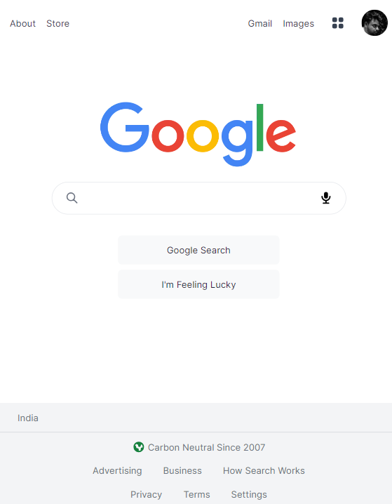
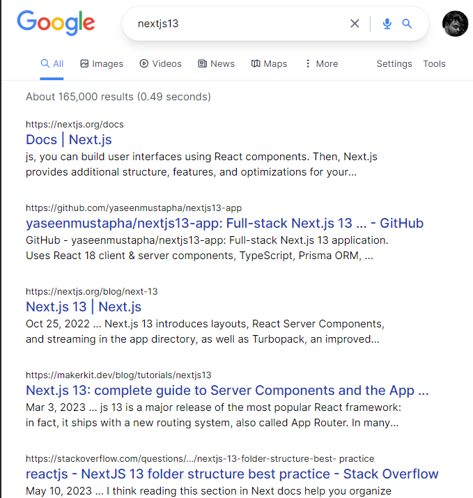
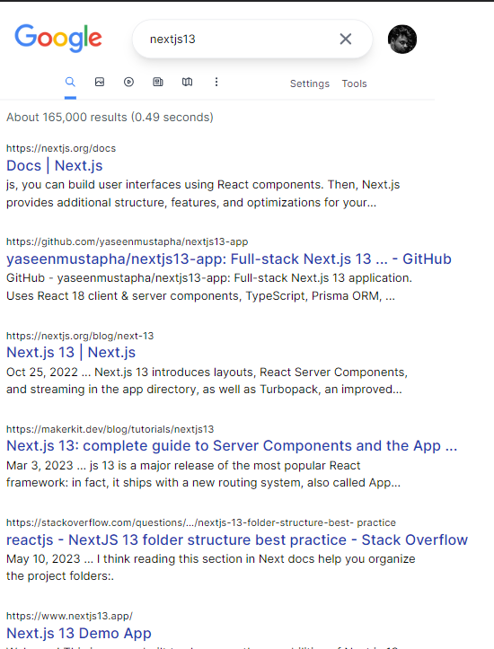

# Google Clone

Welcome to my Google Clone project! This responsive web application replicates the Google search engine, built using advanced technologies such as Next.js 13 and Tailwind CSS, with a focus on server-side rendering (SSR).

## Key Features

- **Server-Side Rendering (SSR):** Employing Next.js's SSR capabilities, this application ensures rapid page load times, delivering content efficiently to users.
- **Routing and URL Parameter Handling:** Seamlessly navigating between pages is made possible with Next.js's routing system, along with the effective utilization of "searchparams" hooks for URL parameter extraction.
- **Image Optimization:** Leveraging Next.js's "Image" tag with automatic image optimization, the application efficiently loads images as users scroll, enhancing performance during initial page loads.
- **Dynamic Meta Data Generation:** Implementing dynamic meta data enables the customization of individual page titles and descriptions, contributing to improved search engine visibility and SEO performance.
- **Efficient API Usage and Caching Techniques:** To manage APIs with rate limits, strategic caching techniques are employed, preventing API limit exceedance by utilizing cached data effectively.
- **Pagination for Handling Multiple API Responses:** Employing pagination ensures organized and user-friendly content presentation, seamlessly slicing data into separate pages.

## Responsive Design

This project features a fully responsive design, meticulously crafted using Tailwind CSS's responsive utility classes. The application's adaptability extends across various devices, including desktops, tablets, and mobile phones. As users access the application from different devices, the layout dynamically adjusts, ensuring an optimal user experience regardless of the screen size or orientation.

<!-- ## Deployed Link -->

<!-- Access the deployed application [here](https://your-deployed-link.com). -->

## Screenshot

## Credits

This project was created by [Mohammed Saif].
